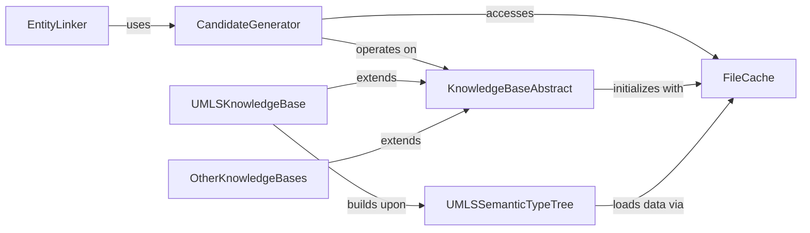

## Component Details

The Core Entity Linking System is responsible for identifying and linking biomedical entities within text to concepts in a knowledge base. Its main flow involves the `EntityLinker` orchestrating the process, which utilizes a `CandidateGenerator` to propose potential entities. These candidates are then disambiguated and linked to specific concepts from various `KnowledgeBase` implementations (e.g., UMLS, Mesh), with `FileCache` managing the efficient loading of necessary data resources.

### EntityLinker

The primary component responsible for linking text spans to concepts in a knowledge base. It orchestrates the candidate generation and disambiguation process.

**Related Classes/Methods**:

- <a href="https://github.com/allenai/scispacy/blob/master/scispacy/linking.py#L9-L130" target="_blank" rel="noopener noreferrer">`scispacy.linking.EntityLinker` (9:130)</a>

- <a href="https://github.com/allenai/scispacy/blob/master/scispacy/linking.py#L69-L93" target="_blank" rel="noopener noreferrer">`scispacy.linking.EntityLinker.__init__` (69:93)</a>

- <a href="https://github.com/allenai/scispacy/blob/master/scispacy/linking.py#L95-L130" target="_blank" rel="noopener noreferrer">`scispacy.linking.EntityLinker.__call__` (95:130)</a>

### CandidateGenerator

Generates a set of potential candidate entities from a knowledge base for a given input mention. It utilizes an approximate nearest neighbors index for efficient retrieval.

**Related Classes/Methods**:

- <a href="https://github.com/allenai/scispacy/blob/master/scispacy/candidate_generation.py#L197-L235" target="_blank" rel="noopener noreferrer">`scispacy.candidate_generation.CandidateGenerator.__init__` (197:235)</a>

- <a href="https://github.com/allenai/scispacy/blob/master/scispacy/candidate_generation.py#L292-L361" target="_blank" rel="noopener noreferrer">`scispacy.candidate_generation.CandidateGenerator.__call__` (292:361)</a>

- <a href="https://github.com/allenai/scispacy/blob/master/scispacy/candidate_generation.py#L116-L145" target="_blank" rel="noopener noreferrer">`scispacy.candidate_generation.load_approximate_nearest_neighbours_index` (116:145)</a>

- <a href="https://github.com/allenai/scispacy/blob/master/scispacy/candidate_generation.py#L364-L474" target="_blank" rel="noopener noreferrer">`scispacy.candidate_generation.create_tfidf_ann_index` (364:474)</a>

### FileCache

Provides utilities for caching files, particularly for downloading and managing external data resources like knowledge base files, ensuring efficient access and reducing redundant downloads.

**Related Classes/Methods**:

- `scispacy.file_cache.cached_path` (full file reference)

- `scispacy.file_cache.get_from_cache` (full file reference)

- `scispacy.file_cache.url_to_filename` (full file reference)

- `scispacy.file_cache.http_get` (full file reference)

### KnowledgeBaseAbstract

Defines the interface and common functionalities for various knowledge bases used in the entity linking process. It serves as a base class for specific knowledge base implementations.

**Related Classes/Methods**:

- <a href="https://github.com/allenai/scispacy/blob/master/scispacy/linking_utils.py#L52-L76" target="_blank" rel="noopener noreferrer">`scispacy.linking_utils.KnowledgeBase.__init__` (52:76)</a>

### UMLSKnowledgeBase

A concrete implementation of a knowledge base specifically for UMLS (Unified Medical Language System) concepts. It extends the abstract KnowledgeBase and integrates with the UMLS semantic type tree.

**Related Classes/Methods**:

- <a href="https://github.com/allenai/scispacy/blob/master/scispacy/linking_utils.py#L80-L89" target="_blank" rel="noopener noreferrer">`scispacy.linking_utils.UmlsKnowledgeBase.__init__` (80:89)</a>

### UMLSSemanticTypeTree

Manages the hierarchical structure of UMLS semantic types, allowing for operations like traversing the tree, finding parents, children, and collapsing types at different levels.

**Related Classes/Methods**:

- <a href="https://github.com/allenai/scispacy/blob/master/scispacy/umls_semantic_type_tree.py#L81-L114" target="_blank" rel="noopener noreferrer">`scispacy.umls_semantic_type_tree.construct_umls_tree_from_tsv` (81:114)</a>

- <a href="https://github.com/allenai/scispacy/blob/master/scispacy/umls_semantic_type_tree.py#L19-L28" target="_blank" rel="noopener noreferrer">`scispacy.umls_semantic_type_tree.UmlsSemanticTypeTree.__init__` (19:28)</a>

- <a href="https://github.com/allenai/scispacy/blob/master/scispacy/umls_semantic_type_tree.py#L42-L50" target="_blank" rel="noopener noreferrer">`scispacy.umls_semantic_type_tree.UmlsSemanticTypeTree.get_children` (42:50)</a>

- <a href="https://github.com/allenai/scispacy/blob/master/scispacy/umls_semantic_type_tree.py#L52-L65" target="_blank" rel="noopener noreferrer">`scispacy.umls_semantic_type_tree.UmlsSemanticTypeTree.get_parent` (52:65)</a>

- <a href="https://github.com/allenai/scispacy/blob/master/scispacy/umls_semantic_type_tree.py#L67-L78" target="_blank" rel="noopener noreferrer">`scispacy.umls_semantic_type_tree.UmlsSemanticTypeTree.get_collapsed_type_id_map_at_level` (67:78)</a>

### OtherKnowledgeBases

Represents other specific knowledge base implementations like Mesh, Gene Ontology, Human Phenotype Ontology, and RxNorm, all inheriting from the abstract KnowledgeBase.

**Related Classes/Methods**:

- <a href="https://github.com/allenai/scispacy/blob/master/scispacy/linking_utils.py#L93-L97" target="_blank" rel="noopener noreferrer">`scispacy.linking_utils.Mesh.__init__` (93:97)</a>

- <a href="https://github.com/allenai/scispacy/blob/master/scispacy/linking_utils.py#L101-L105" target="_blank" rel="noopener noreferrer">`scispacy.linking_utils.GeneOntology.__init__` (101:105)</a>

- <a href="https://github.com/allenai/scispacy/blob/master/scispacy/linking_utils.py#L109-L113" target="_blank" rel="noopener noreferrer">`scispacy.linking_utils.HumanPhenotypeOntology.__init__` (109:113)</a>

- <a href="https://github.com/allenai/scispacy/blob/master/scispacy/linking_utils.py#L117-L121" target="_blank" rel="noopener noreferrer">`scispacy.linking_utils.RxNorm.__init__` (117:121)</a>

### [FAQ](https://github.com/CodeBoarding/GeneratedOnBoardings/tree/main?tab=readme-ov-file#faq)