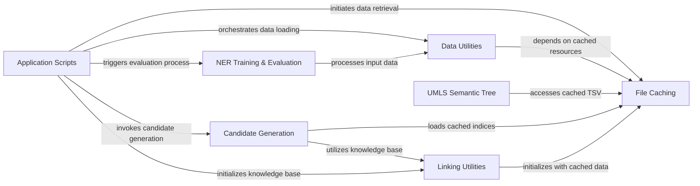

## Component Details

The Data Management & Evaluation subsystem in scispacy is responsible for the robust handling of data throughout its lifecycle, from efficient loading and caching of external resources to the preparation and evaluation of models. It ensures that data is readily available and correctly formatted for various tasks, including Named Entity Recognition (NER) and entity linking, and provides comprehensive tools for assessing model performance.

### File Caching

Manages the downloading, caching, and retrieval of files from URLs or local paths to ensure efficient access to external resources across the scispacy library.

**Related Classes/Methods**:

- <a href="https://github.com/allenai/scispacy/blob/master/scispacy/file_cache.py#L21-L50" target="_blank" rel="noopener noreferrer">`scispacy.file_cache.cached_path` (21:50)</a>

- <a href="https://github.com/allenai/scispacy/blob/master/scispacy/file_cache.py#L109-L158" target="_blank" rel="noopener noreferrer">`scispacy.file_cache.get_from_cache` (109:158)</a>

- <a href="https://github.com/allenai/scispacy/blob/master/scispacy/file_cache.py#L53-L71" target="_blank" rel="noopener noreferrer">`scispacy.file_cache.url_to_filename` (53:71)</a>

- <a href="https://github.com/allenai/scispacy/blob/master/scispacy/file_cache.py#L98-L106" target="_blank" rel="noopener noreferrer">`scispacy.file_cache.http_get` (98:106)</a>

### Data Utilities

Provides functions for reading, parsing, and preprocessing various biomedical datasets, such as MedMentions and NER TSV files, preparing them for further processing or model training.

**Related Classes/Methods**:

- <a href="https://github.com/allenai/scispacy/blob/master/scispacy/data_util.py#L148-L232" target="_blank" rel="noopener noreferrer">`scispacy.data_util.read_full_med_mentions` (148:232)</a>

- <a href="https://github.com/allenai/scispacy/blob/master/scispacy/data_util.py#L276-L317" target="_blank" rel="noopener noreferrer">`scispacy.data_util.read_ner_from_tsv` (276:317)</a>

- <a href="https://github.com/allenai/scispacy/blob/master/scispacy/data_util.py#L51-L66" target="_blank" rel="noopener noreferrer">`scispacy.data_util.med_mentions_example_iterator` (51:66)</a>

- <a href="https://github.com/allenai/scispacy/blob/master/scispacy/data_util.py#L26-L48" target="_blank" rel="noopener noreferrer">`scispacy.data_util.process_example` (26:48)</a>

- <a href="https://github.com/allenai/scispacy/blob/master/scispacy/data_util.py#L202-L208" target="_blank" rel="noopener noreferrer">`scispacy.data_util.read_full_med_mentions.label_function` (202:208)</a>

- <a href="https://github.com/allenai/scispacy/blob/master/scispacy/data_util.py#L98-L145" target="_blank" rel="noopener noreferrer">`scispacy.data_util.remove_overlapping_entities` (98:145)</a>

- <a href="https://github.com/allenai/scispacy/blob/master/scispacy/data_util.py#L238-L273" target="_blank" rel="noopener noreferrer">`scispacy.data_util._handle_sentence` (238:273)</a>

### NER Training & Evaluation

Contains functionalities for evaluating Named Entity Recognition models and calculating performance metrics, crucial for assessing model accuracy and performance.

**Related Classes/Methods**:

- <a href="https://github.com/allenai/scispacy/blob/master/scispacy/train_utils.py#L9-L33" target="_blank" rel="noopener noreferrer">`scispacy.train_utils.evaluate_ner` (9:33)</a>

- <a href="https://github.com/allenai/scispacy/blob/master/scispacy/per_class_scorer.py#L5-L103" target="_blank" rel="noopener noreferrer">`scispacy.per_class_scorer.PerClassScorer` (5:103)</a>

- <a href="https://github.com/allenai/scispacy/blob/master/scispacy/per_class_scorer.py#L40-L87" target="_blank" rel="noopener noreferrer">`scispacy.per_class_scorer.PerClassScorer.get_metric` (40:87)</a>

- <a href="https://github.com/allenai/scispacy/blob/master/scispacy/per_class_scorer.py#L90-L98" target="_blank" rel="noopener noreferrer">`scispacy.per_class_scorer.PerClassScorer._compute_metrics` (90:98)</a>

- <a href="https://github.com/allenai/scispacy/blob/master/scispacy/per_class_scorer.py#L100-L103" target="_blank" rel="noopener noreferrer">`scispacy.per_class_scorer.PerClassScorer.reset` (100:103)</a>

### Candidate Generation

Responsible for loading approximate nearest neighbors indices and generating potential candidate entities, a critical step in the entity linking process.

**Related Classes/Methods**:

- <a href="https://github.com/allenai/scispacy/blob/master/scispacy/candidate_generation.py#L116-L145" target="_blank" rel="noopener noreferrer">`scispacy.candidate_generation.load_approximate_nearest_neighbours_index` (116:145)</a>

- <a href="https://github.com/allenai/scispacy/blob/master/scispacy/candidate_generation.py#L197-L235" target="_blank" rel="noopener noreferrer">`scispacy.candidate_generation.CandidateGenerator.__init__` (197:235)</a>

### Linking Utilities

Offers core utilities for entity linking, including the initialization and management of knowledge bases used for mapping entities to standardized concepts.

**Related Classes/Methods**:

- <a href="https://github.com/allenai/scispacy/blob/master/scispacy/linking_utils.py#L52-L76" target="_blank" rel="noopener noreferrer">`scispacy.linking_utils.KnowledgeBase.__init__` (52:76)</a>

### UMLS Semantic Tree

Manages the construction and representation of the hierarchical structure of UMLS semantic types, enabling semantic reasoning and classification.

**Related Classes/Methods**:

- <a href="https://github.com/allenai/scispacy/blob/master/scispacy/umls_semantic_type_tree.py#L81-L114" target="_blank" rel="noopener noreferrer">`scispacy.umls_semantic_type_tree.construct_umls_tree_from_tsv` (81:114)</a>

- <a href="https://github.com/allenai/scispacy/blob/master/scispacy/umls_semantic_type_tree.py#L105-L109" target="_blank" rel="noopener noreferrer">`scispacy.umls_semantic_type_tree.construct_umls_tree_from_tsv.attach_children` (105:109)</a>

- <a href="https://github.com/allenai/scispacy/blob/master/scispacy/umls_semantic_type_tree.py#L13-L78" target="_blank" rel="noopener noreferrer">`scispacy.umls_semantic_type_tree.UmlsSemanticTypeTree` (13:78)</a>

### Application Scripts

Serves as the main entry points for various command-line applications within scispacy, orchestrating the execution of different functionalities like data conversion, NER evaluation, and linker evaluation.

**Related Classes/Methods**:

- <a href="https://github.com/allenai/scispacy/blob/master/scripts/convert_freqs.py#L40-L59" target="_blank" rel="noopener noreferrer">`scispacy.scripts.convert_freqs.main` (40:59)</a>

- <a href="https://github.com/allenai/scispacy/blob/master/scripts/evaluate_ner.py#L12-L37" target="_blank" rel="noopener noreferrer">`scispacy.scripts.evaluate_ner.main` (12:37)</a>

- <a href="https://github.com/allenai/scispacy/blob/master/evaluation/evaluate_linker.py#L9-L74" target="_blank" rel="noopener noreferrer">`scispacy.evaluation.evaluate_linker.main` (9:74)</a>

### [FAQ](https://github.com/CodeBoarding/GeneratedOnBoardings/tree/main?tab=readme-ov-file#faq)