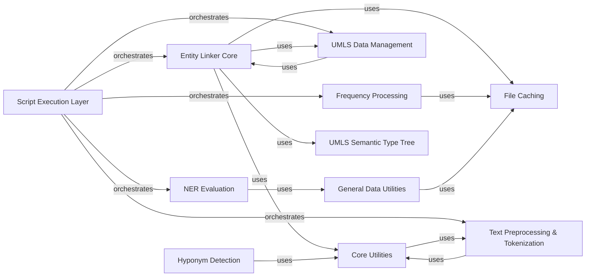

## Component Details

This architecture overview details the key components of the SciSpacy library, focusing on their structure, interdependencies, and primary functionalities. The system is designed around a modular approach, with a central Script Execution Layer orchestrating high-level workflows. Core functionalities include entity linking, frequency processing, NER evaluation, and robust UMLS data management. Supporting components provide essential utilities like text preprocessing, file caching, and general data handling, ensuring efficient and scalable operations across the library.

### Script Execution Layer

Encompasses the main executable scripts and entry points, orchestrating high-level workflows for various SciSpacy functionalities.

**Related Classes/Methods**:

- <a href="https://github.com/allenai/scispacy/blob/master/scripts/create_linker.py#L7-L11" target="_blank" rel="noopener noreferrer">`scispacy.scripts.create_linker.main` (7:11)</a>

- <a href="https://github.com/allenai/scispacy/blob/master/scripts/convert_freqs.py#L40-L59" target="_blank" rel="noopener noreferrer">`scispacy.scripts.convert_freqs.main` (40:59)</a>

- <a href="https://github.com/allenai/scispacy/blob/master/scripts/count_word_frequencies.py#L64-L81" target="_blank" rel="noopener noreferrer">`scispacy.scripts.count_word_frequencies.main` (64:81)</a>

- <a href="https://github.com/allenai/scispacy/blob/master/scripts/evaluate_ner.py#L12-L37" target="_blank" rel="noopener noreferrer">`scispacy.scripts.evaluate_ner.main` (12:37)</a>

- <a href="https://github.com/allenai/scispacy/blob/master/scripts/export_umls_json.py#L10-L90" target="_blank" rel="noopener noreferrer">`scispacy.scripts.export_umls_json.main` (10:90)</a>

- <a href="https://github.com/allenai/scispacy/blob/master/evaluation/evaluate_linker.py#L9-L74" target="_blank" rel="noopener noreferrer">`scispacy.evaluation.evaluate_linker.main` (9:74)</a>

- <a href="https://github.com/allenai/scispacy/blob/master/evaluation/sentence_splitting_evaluation.py#L11-L77" target="_blank" rel="noopener noreferrer">`scispacy.evaluation.sentence_splitting_evaluation.evaluate_sentence_splitting` (11:77)</a>

### Entity Linker Core

This component encapsulates the core logic for creating and managing the scispaCy entity linker, including the knowledge base, candidate generation, and linking mechanisms.

**Related Classes/Methods**:

- <a href="https://github.com/allenai/scispacy/blob/master/scispacy/linking_utils.py#L40-L76" target="_blank" rel="noopener noreferrer">`scispacy.linking_utils.KnowledgeBase` (40:76)</a>

- <a href="https://github.com/allenai/scispacy/blob/master/scispacy/candidate_generation.py#L364-L474" target="_blank" rel="noopener noreferrer">`scispacy.candidate_generation.create_tfidf_ann_index` (364:474)</a>

- `scispacy.linking.Linker` (full file reference)

- `scispacy.umls_linking.UMLSLinker` (full file reference)

### Frequency Processing

This component handles the processing and analysis of word frequencies, including counting, parallelization, merging, and conversion of frequency data.

**Related Classes/Methods**:

- <a href="https://github.com/allenai/scispacy/blob/master/scripts/convert_freqs.py#L40-L59" target="_blank" rel="noopener noreferrer">`scispacy.scripts.convert_freqs.main` (40:59)</a>

- <a href="https://github.com/allenai/scispacy/blob/master/scripts/convert_freqs.py#L10-L37" target="_blank" rel="noopener noreferrer">`scispacy.scripts.convert_freqs.read_freqs` (10:37)</a>

- <a href="https://github.com/allenai/scispacy/blob/master/scripts/count_word_frequencies.py#L64-L81" target="_blank" rel="noopener noreferrer">`scispacy.scripts.count_word_frequencies.main` (64:81)</a>

- <a href="https://github.com/allenai/scispacy/blob/master/scripts/count_word_frequencies.py#L39-L42" target="_blank" rel="noopener noreferrer">`scispacy.scripts.count_word_frequencies.parallelize` (39:42)</a>

- <a href="https://github.com/allenai/scispacy/blob/master/scripts/count_word_frequencies.py#L44-L57" target="_blank" rel="noopener noreferrer">`scispacy.scripts.count_word_frequencies.merge_counts` (44:57)</a>

### NER Evaluation

This component provides the functionality for evaluating Named Entity Recognition (NER) models, including data loading and performance metrics.

**Related Classes/Methods**:

- <a href="https://github.com/allenai/scispacy/blob/master/scispacy/train_utils.py#L9-L33" target="_blank" rel="noopener noreferrer">`scispacy.train_utils.evaluate_ner` (9:33)</a>

- `scispacy.per_class_scorer.Scorer` (full file reference)

### UMLS Data Management

This component provides utilities for reading, processing, and exporting data from the Unified Medical Language System (UMLS), including concepts, types, and definitions.

**Related Classes/Methods**:

- <a href="https://github.com/allenai/scispacy/blob/master/scispacy/umls_utils.py#L39-L108" target="_blank" rel="noopener noreferrer">`scispacy.umls_utils.read_umls_concepts` (39:108)</a>

- <a href="https://github.com/allenai/scispacy/blob/master/scispacy/umls_utils.py#L111-L136" target="_blank" rel="noopener noreferrer">`scispacy.umls_utils.read_umls_types` (111:136)</a>

- <a href="https://github.com/allenai/scispacy/blob/master/scispacy/umls_utils.py#L139-L178" target="_blank" rel="noopener noreferrer">`scispacy.umls_utils.read_umls_definitions` (139:178)</a>

### General Data Utilities

This component offers common utility functions for reading and processing various datasets, particularly those used in evaluation tasks across different scispaCy modules.

**Related Classes/Methods**:

- <a href="https://github.com/allenai/scispacy/blob/master/scispacy/data_util.py#L148-L232" target="_blank" rel="noopener noreferrer">`scispacy.data_util.read_full_med_mentions` (148:232)</a>

- <a href="https://github.com/allenai/scispacy/blob/master/scispacy/data_util.py#L276-L317" target="_blank" rel="noopener noreferrer">`scispacy.data_util.read_ner_from_tsv` (276:317)</a>

### Text Preprocessing & Tokenization

This component focuses on fundamental text preprocessing tasks such as sentence splitting and custom tokenization, including rule-based tokenizers and text cleaning functions.

**Related Classes/Methods**:

- <a href="https://github.com/allenai/scispacy/blob/master/scispacy/custom_tokenizer.py#L47-L135" target="_blank" rel="noopener noreferrer">`scispacy.custom_tokenizer.combined_rule_tokenizer` (47:135)</a>

- <a href="https://github.com/allenai/scispacy/blob/master/scispacy/custom_tokenizer.py#L11-L22" target="_blank" rel="noopener noreferrer">`scispacy.custom_tokenizer.remove_new_lines` (11:22)</a>

- `scispacy.custom_sentence_segmenter.SentenceSegmenter` (full file reference)

### File Caching

This component provides a mechanism for caching file paths, optimizing access to frequently used files and resources within the scispaCy project.

**Related Classes/Methods**:

- `scispacy.file_cache.cached_path` (full file reference)

### UMLS Semantic Type Tree

This component manages the hierarchical structure and relationships of UMLS semantic types, crucial for understanding medical concepts.

**Related Classes/Methods**:

- `scispacy.umls_semantic_type_tree.UMLSSemanticTypeTree` (full file reference)

### Hyponym Detection

This component provides functionalities for detecting hyponyms using Hearst patterns.

**Related Classes/Methods**:

- <a href="https://github.com/allenai/scispacy/blob/master/scispacy/hyponym_detector.py#L8-L141" target="_blank" rel="noopener noreferrer">`scispacy.hyponym_detector.HyponymDetector` (8:141)</a>

- `scispacy.hearst_patterns.hearst_patterns` (full file reference)

### Core Utilities

This component provides general utility functions and constants that are widely used across different parts of the scispaCy library.

**Related Classes/Methods**:

- `scispacy.util` (full file reference)

- `scispacy.consts` (full file reference)

### [FAQ](https://github.com/CodeBoarding/GeneratedOnBoardings/tree/main?tab=readme-ov-file#faq)