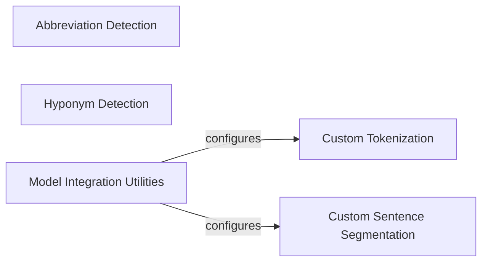

## Component Details

This subsystem provides specialized functionalities for preparing biomedical text, including abbreviation detection, hyponym detection, and custom tokenization/sentence segmentation rules. It aims to enhance the accuracy of NLP tasks on scientific documents by tailoring text processing to the unique characteristics of biomedical language.

### Abbreviation Detection

This module is responsible for identifying and extracting abbreviations and their corresponding long forms from text. It utilizes spaCy's Matcher to find patterns and applies filtering rules to refine the detected abbreviations.

**Related Classes/Methods**:

- <a href="https://github.com/allenai/scispacy/blob/master/scispacy/abbreviation.py#L154-L277" target="_blank" rel="noopener noreferrer">`scispacy.abbreviation.AbbreviationDetector` (154:277)</a>

- <a href="https://github.com/allenai/scispacy/blob/master/scispacy/abbreviation.py#L98-L135" target="_blank" rel="noopener noreferrer">`scispacy.abbreviation.filter_matches` (98:135)</a>

- <a href="https://github.com/allenai/scispacy/blob/master/scispacy/abbreviation.py#L84-L95" target="_blank" rel="noopener noreferrer">`scispacy.abbreviation.span_contains_unbalanced_parentheses` (84:95)</a>

- <a href="https://github.com/allenai/scispacy/blob/master/scispacy/abbreviation.py#L138-L150" target="_blank" rel="noopener noreferrer">`scispacy.abbreviation.short_form_filter` (138:150)</a>

- <a href="https://github.com/allenai/scispacy/blob/master/scispacy/abbreviation.py#L7-L81" target="_blank" rel="noopener noreferrer">`scispacy.abbreviation.find_abbreviation` (7:81)</a>

### Custom Tokenization

This module provides a custom tokenizer for spaCy models, extending the default tokenization rules with specific patterns relevant to scientific text. It modifies how text is split into tokens, which is crucial for downstream NLP tasks.

**Related Classes/Methods**:

- <a href="https://github.com/allenai/scispacy/blob/master/scispacy/custom_tokenizer.py#L47-L135" target="_blank" rel="noopener noreferrer">`scispacy.custom_tokenizer.combined_rule_tokenizer` (47:135)</a>

- <a href="https://github.com/allenai/scispacy/blob/master/scispacy/custom_tokenizer.py#L25-L44" target="_blank" rel="noopener noreferrer">`scispacy.custom_tokenizer.combined_rule_prefixes` (25:44)</a>

- <a href="https://github.com/allenai/scispacy/blob/master/scispacy/custom_tokenizer.py#L11-L22" target="_blank" rel="noopener noreferrer">`scispacy.custom_tokenizer.remove_new_lines` (11:22)</a>

### Hyponym Detection

This module is designed to identify hyponyms (more specific terms) and hypernyms (more general terms) within text using Hearst patterns. It leverages spaCy's Matcher to find linguistic patterns indicative of hyponymy relationships and expands tokens to noun phrases for more comprehensive extraction.

**Related Classes/Methods**:

- <a href="https://github.com/allenai/scispacy/blob/master/scispacy/hyponym_detector.py#L8-L141" target="_blank" rel="noopener noreferrer">`scispacy.hyponym_detector.HyponymDetector` (8:141)</a>

### Custom Sentence Segmentation

This module provides a custom sentence segmenter for spaCy models, utilizing the `pysbd` library and applying specific rules to handle biomedical text, including new lines and abbreviations.

**Related Classes/Methods**:

- <a href="https://github.com/allenai/scispacy/blob/master/scispacy/custom_sentence_segmenter.py#L12-L53" target="_blank" rel="noopener noreferrer">`scispacy.custom_sentence_segmenter.pysbd_sentencizer` (12:53)</a>

### Model Integration Utilities

This component provides utility functions for integrating custom tokenization and sentence segmentation rules into a spaCy pipeline, allowing for the creation of specialized spaCy models.

**Related Classes/Methods**:

- <a href="https://github.com/allenai/scispacy/blob/master/scispacy/util.py#L14-L18" target="_blank" rel="noopener noreferrer">`scispacy.util.create_combined_rule_model` (14:18)</a>

- <a href="https://github.com/allenai/scispacy/blob/master/scispacy/base_project_code.py#L24-L29" target="_blank" rel="noopener noreferrer">`scispacy.base_project_code.replace_tokenizer_callback` (24:29)</a>

### [FAQ](https://github.com/CodeBoarding/GeneratedOnBoardings/tree/main?tab=readme-ov-file#faq)