```mermaid

graph LR

    Core_Entity_Linking_System["Core Entity Linking System"]

    Knowledge_Base_Candidate_Management["Knowledge Base & Candidate Management"]

    UMLS_Data_Semantic_Tree["UMLS Data & Semantic Tree"]

    Text_Preprocessing_Utilities["Text Preprocessing & Utilities"]

    Data_Management_Evaluation["Data Management & Evaluation"]

    Script_Execution_Layer["Script Execution Layer"]

    Script_Execution_Layer -- "orchestrates" --> Core_Entity_Linking_System

    Script_Execution_Layer -- "manages workflows for" --> Data_Management_Evaluation

    Script_Execution_Layer -- "orchestrates" --> UMLS_Data_Semantic_Tree

    Core_Entity_Linking_System -- "utilizes" --> Knowledge_Base_Candidate_Management

    Core_Entity_Linking_System -- "processes text with" --> Text_Preprocessing_Utilities

    Knowledge_Base_Candidate_Management -- "accesses" --> UMLS_Data_Semantic_Tree

    Knowledge_Base_Candidate_Management -- "loads data via" --> Data_Management_Evaluation

    UMLS_Data_Semantic_Tree -- "loads data via" --> Data_Management_Evaluation

    Data_Management_Evaluation -- "provides data for" --> Text_Preprocessing_Utilities

    Data_Management_Evaluation -- "caches resources for" --> Knowledge_Base_Candidate_Management

    click Core_Entity_Linking_System href "https://github.com/allenai/scispacy/blob/main/.codeboarding//Core Entity Linking System.md" "Details"

    click Knowledge_Base_Candidate_Management href "https://github.com/allenai/scispacy/blob/main/.codeboarding//Knowledge Base & Candidate Management.md" "Details"

    click UMLS_Data_Semantic_Tree href "https://github.com/allenai/scispacy/blob/main/.codeboarding//UMLS Data & Semantic Tree.md" "Details"

    click Text_Preprocessing_Utilities href "https://github.com/allenai/scispacy/blob/main/.codeboarding//Text Preprocessing & Utilities.md" "Details"

    click Data_Management_Evaluation href "https://github.com/allenai/scispacy/blob/main/.codeboarding//Data Management & Evaluation.md" "Details"

    click Script_Execution_Layer href "https://github.com/allenai/scispacy/blob/main/.codeboarding//Script Execution Layer.md" "Details"

```

## Component Details

The SciSpacy library provides a comprehensive suite of tools for biomedical natural language processing, primarily focusing on entity linking. The main flow involves preprocessing biomedical text, identifying entities, linking them to concepts in various knowledge bases (like UMLS), and evaluating the performance of these NLP models. It leverages efficient data management and caching for large datasets and models.

### Core Entity Linking System

The central component for identifying and linking biomedical entities in text to concepts within a knowledge base, integrating candidate generation and knowledge base lookups.

**Related Classes/Methods**:

- <a href="https://github.com/allenai/scispacy/blob/master/scispacy/linking.py#L9-L130" target="_blank" rel="noopener noreferrer">`scispacy.linking.EntityLinker` (9:130)</a>

- <a href="https://github.com/allenai/scispacy/blob/master/scispacy/linking.py#L69-L93" target="_blank" rel="noopener noreferrer">`scispacy.linking.EntityLinker.__init__` (69:93)</a>

- <a href="https://github.com/allenai/scispacy/blob/master/scispacy/linking.py#L95-L130" target="_blank" rel="noopener noreferrer">`scispacy.linking.EntityLinker.__call__` (95:130)</a>

### Knowledge Base & Candidate Management

Manages various biomedical knowledge bases and efficiently generates potential entity candidates for given text spans using approximate nearest neighbor techniques.

**Related Classes/Methods**:

- <a href="https://github.com/allenai/scispacy/blob/master/scispacy/candidate_generation.py#L148-L361" target="_blank" rel="noopener noreferrer">`scispacy.candidate_generation.CandidateGenerator` (148:361)</a>

- <a href="https://github.com/allenai/scispacy/blob/master/scispacy/candidate_generation.py#L116-L145" target="_blank" rel="noopener noreferrer">`scispacy.candidate_generation.load_approximate_nearest_neighbours_index` (116:145)</a>

- <a href="https://github.com/allenai/scispacy/blob/master/scispacy/linking_utils.py#L40-L76" target="_blank" rel="noopener noreferrer">`scispacy.linking_utils.KnowledgeBase` (40:76)</a>

- <a href="https://github.com/allenai/scispacy/blob/master/scispacy/linking_utils.py#L79-L89" target="_blank" rel="noopener noreferrer">`scispacy.linking_utils.UmlsKnowledgeBase` (79:89)</a>

- <a href="https://github.com/allenai/scispacy/blob/master/scispacy/linking_utils.py#L92-L97" target="_blank" rel="noopener noreferrer">`scispacy.linking_utils.Mesh` (92:97)</a>

- <a href="https://github.com/allenai/scispacy/blob/master/scispacy/linking_utils.py#L100-L105" target="_blank" rel="noopener noreferrer">`scispacy.linking_utils.GeneOntology` (100:105)</a>

- <a href="https://github.com/allenai/scispacy/blob/master/scispacy/linking_utils.py#L108-L113" target="_blank" rel="noopener noreferrer">`scispacy.linking_utils.HumanPhenotypeOntology` (108:113)</a>

- <a href="https://github.com/allenai/scispacy/blob/master/scispacy/linking_utils.py#L116-L121" target="_blank" rel="noopener noreferrer">`scispacy.linking_utils.RxNorm` (116:121)</a>

### UMLS Data & Semantic Tree

Handles the parsing, processing, and hierarchical organization of data from the UMLS Metathesaurus, including reading UMLS files and constructing a semantic type tree.

**Related Classes/Methods**:

- <a href="https://github.com/allenai/scispacy/blob/master/scispacy/umls_utils.py#L39-L108" target="_blank" rel="noopener noreferrer">`scispacy.umls_utils.read_umls_concepts` (39:108)</a>

- <a href="https://github.com/allenai/scispacy/blob/master/scispacy/umls_utils.py#L111-L136" target="_blank" rel="noopener noreferrer">`scispacy.umls_utils.read_umls_types` (111:136)</a>

- <a href="https://github.com/allenai/scispacy/blob/master/scispacy/umls_utils.py#L139-L178" target="_blank" rel="noopener noreferrer">`scispacy.umls_utils.read_umls_definitions` (139:178)</a>

- <a href="https://github.com/allenai/scispacy/blob/master/scispacy/umls_semantic_type_tree.py#L13-L78" target="_blank" rel="noopener noreferrer">`scispacy.umls_semantic_type_tree.UmlsSemanticTypeTree` (13:78)</a>

- <a href="https://github.com/allenai/scispacy/blob/master/scispacy/umls_semantic_type_tree.py#L81-L114" target="_blank" rel="noopener noreferrer">`scispacy.umls_semantic_type_tree.construct_umls_tree_from_tsv` (81:114)</a>

### Text Preprocessing & Utilities

Provides specialized functionalities for preparing biomedical text, including abbreviation detection, hyponym detection, and custom tokenization/sentence segmentation rules.

**Related Classes/Methods**:

- <a href="https://github.com/allenai/scispacy/blob/master/scispacy/abbreviation.py#L154-L277" target="_blank" rel="noopener noreferrer">`scispacy.abbreviation.AbbreviationDetector` (154:277)</a>

- <a href="https://github.com/allenai/scispacy/blob/master/scispacy/hyponym_detector.py#L8-L141" target="_blank" rel="noopener noreferrer">`scispacy.hyponym_detector.HyponymDetector` (8:141)</a>

- <a href="https://github.com/allenai/scispacy/blob/master/scispacy/custom_tokenizer.py#L47-L135" target="_blank" rel="noopener noreferrer">`scispacy.custom_tokenizer.combined_rule_tokenizer` (47:135)</a>

- `scispacy.custom_sentence_segmenter.combined_rule_sentence_segmenter` (full file reference)

- <a href="https://github.com/allenai/scispacy/blob/master/scispacy/util.py#L14-L18" target="_blank" rel="noopener noreferrer">`scispacy.util.create_combined_rule_model` (14:18)</a>

### Data Management & Evaluation

Manages data loading, efficient file caching, and provides utilities for model training and evaluation, including performance metrics.

**Related Classes/Methods**:

- `scispacy.file_cache.cached_path` (full file reference)

- `scispacy.file_cache.get_from_cache` (full file reference)

- <a href="https://github.com/allenai/scispacy/blob/master/scispacy/data_util.py#L51-L66" target="_blank" rel="noopener noreferrer">`scispacy.data_util.med_mentions_example_iterator` (51:66)</a>

- <a href="https://github.com/allenai/scispacy/blob/master/scispacy/data_util.py#L276-L317" target="_blank" rel="noopener noreferrer">`scispacy.data_util.read_ner_from_tsv` (276:317)</a>

- <a href="https://github.com/allenai/scispacy/blob/master/scispacy/train_utils.py#L9-L33" target="_blank" rel="noopener noreferrer">`scispacy.train_utils.evaluate_ner` (9:33)</a>

- <a href="https://github.com/allenai/scispacy/blob/master/scispacy/per_class_scorer.py#L5-L103" target="_blank" rel="noopener noreferrer">`scispacy.per_class_scorer.PerClassScorer` (5:103)</a>

### Script Execution Layer

Encompasses the main executable scripts and entry points, orchestrating high-level workflows for various SciSpacy functionalities.

**Related Classes/Methods**:

- <a href="https://github.com/allenai/scispacy/blob/master/scripts/create_linker.py#L7-L11" target="_blank" rel="noopener noreferrer">`scispacy.scripts.create_linker.main` (7:11)</a>

- <a href="https://github.com/allenai/scispacy/blob/master/scripts/convert_freqs.py#L40-L59" target="_blank" rel="noopener noreferrer">`scispacy.scripts.convert_freqs.main` (40:59)</a>

- <a href="https://github.com/allenai/scispacy/blob/master/scripts/count_word_frequencies.py#L64-L81" target="_blank" rel="noopener noreferrer">`scispacy.scripts.count_word_frequencies.main` (64:81)</a>

- <a href="https://github.com/allenai/scispacy/blob/master/scripts/evaluate_ner.py#L12-L37" target="_blank" rel="noopener noreferrer">`scispacy.scripts.evaluate_ner.main` (12:37)</a>

- `scispacy.scripts.export_umls_json.main` (full file reference)

- <a href="https://github.com/allenai/scispacy/blob/master/evaluation/evaluate_linker.py#L9-L74" target="_blank" rel="noopener noreferrer">`scispacy.evaluation.evaluate_linker.main` (9:74)</a>

- <a href="https://github.com/allenai/scispacy/blob/master/evaluation/sentence_splitting_evaluation.py#L11-L77" target="_blank" rel="noopener noreferrer">`scispacy.evaluation.sentence_splitting_evaluation.evaluate_sentence_splitting` (11:77)</a>

### [FAQ](https://github.com/CodeBoarding/GeneratedOnBoardings/tree/main?tab=readme-ov-file#faq)